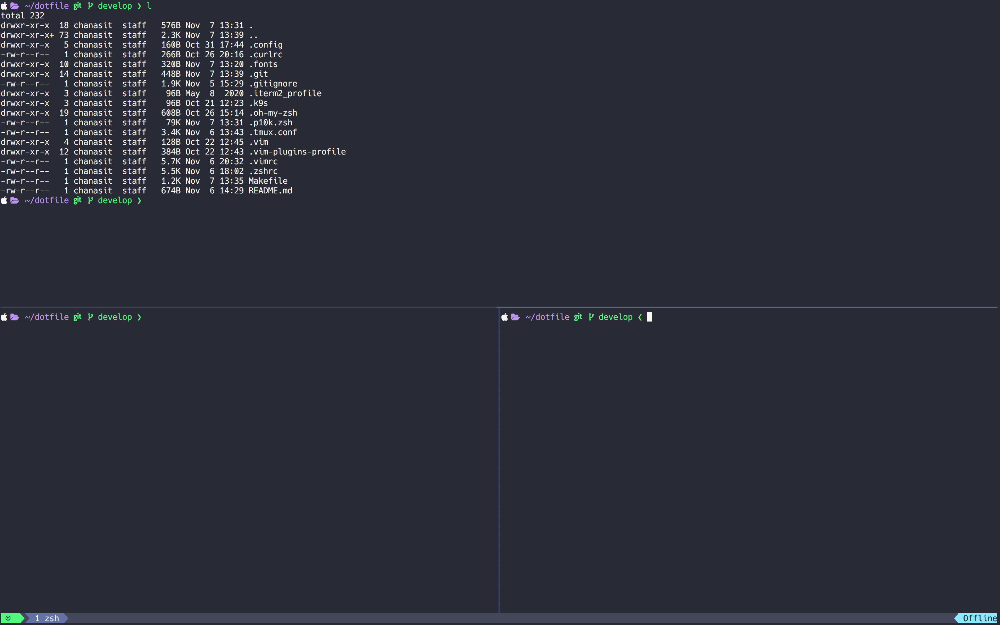
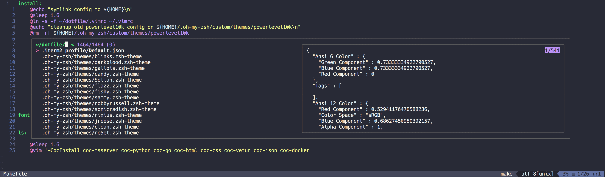

# My dotfile

## Basic setup required
- [brew](https://brew.sh/) (osx)
- [nvim](https://github.com/neovim/neovim)
- [node](https://nodejs.org/en/) 10+  
- [nvm](https://github.com/nvm-sh/nvm)
- [python](https://www.python.org/) 3.6+  
- [tmux](https://github.com/tmux/tmux) 3.1+  
- [rg](https://github.com/BurntSushi/ripgrep) (ripgrep) 12+
- [zsh](https://ohmyz.sh/#install) 5.7+
- [alacritty](https://github.com/alacritty/alacritty) 5.7+
- [p10k](https://github.com/romkatv/powerlevel10k)

## Vim installation

### osx by homebrew
```
$ brew install neovim
```

### ubuntu by apt
```
<<<<<<< HEAD
$ sudo add-apt-repository ppa:jonathonf/vim
$ sudo apt update
$ sudo apt install vim-gtk3 vim-nox
=======
$ snap install nvim --classic
>>>>>>> c2074e7c907e0bad6bf9c64b3cded97a06700fd7
```

## Plugins installation
```
$ make install
```

## Language server installation
```
$ make ls
```

## Review
### tmux 


### vim + fzf

