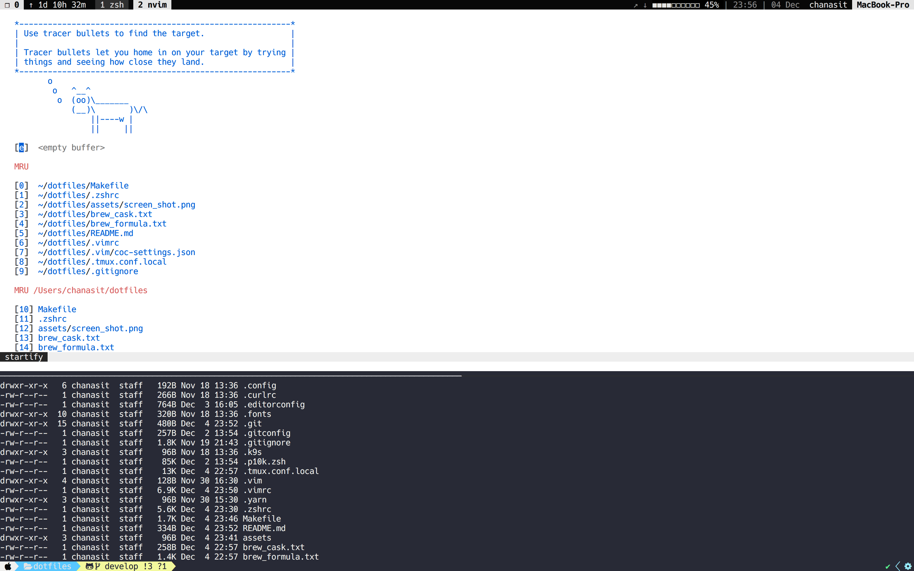

# My dotfile



## Basic setup required
- [brew](https://brew.sh/) (osx)

## Installation with Makefile

Easy to build development environment with this command.
```
$ make install
```

Check all make command
```
$ make help
```
